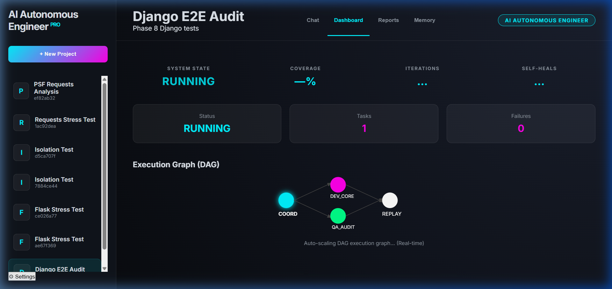

# 🤖 AI Autonomous Engineer

[](https://opensource.org/licenses/MIT)
[](https://www.python.org/)
[](https://fastapi.tiangolo.com/)

An open-source multi-agent platform that **writes, tests, and self-heals code** using a closed-loop agentic engine with mandatory coverage gates.


*Real screenshot: Django E2E Audit running — System State RUNNING, DAG showing COORD → DEV_CORE + QA_AUDIT → REPLAY agents*

---

## ⚡ One-command install

```bash
# Option A — Docker (recommended, zero host setup)
git clone https://github.com/SriSuryaPoola/autonomous-engineer.git
cd autonomous-engineer
echo 'ANTHROPIC_API_KEY="sk-ant-..."' > .env   # or leave blank for heuristic mode
docker compose up --build
# → Backend: http://localhost:8000
# → Dashboard: http://localhost:3000
```

```bash
# Option B — Local Python
pip install -r requirements.txt
python -m uvicorn server.app:app --reload      # Terminal 1
cd ui && python -m http.server 3000            # Terminal 2
```

> **No API key?** Set `LLM_PROVIDER=ollama` in `.env` and run Ollama locally — completely free, no cloud needed.

---

## ⚠️ Known Limitations

| Limitation | Detail |
|---|---|
| **API key required for full LLM mode** | Without `ANTHROPIC_API_KEY`, falls back to regex heuristics only |
| **Token costs** | A convergence cycle costs 10k–50k tokens (~$0.03–$0.15 per task at Sonnet pricing) |
| **Large files truncated** | Files over ~20,000 chars are truncated before being sent to the LLM |
| **Subprocess sandbox** | Tests run in isolated subprocesses — Docker sandboxing is on the roadmap |
| **Small–medium repos work best** | Monorepos with 1,000+ interdependent files may exceed context limits |
| **Windows + Linux tested** | macOS should work but is not formally verified |

---

## 💻 Usage

### Web Dashboard
```bash
# Terminal 1 — backend
python -m uvicorn server.app:app --reload

# Terminal 2 — frontend  
cd ui && python -m http.server 3000
```
Open `http://localhost:3000` → **+ New Project** → paste a task → **Execute**

### Terminal CLI (no browser needed)
```bash
# Audit a GitHub repo, stream live convergence metrics
python cli.py run --repo "https://github.com/pallets/flask" --task "Write QA tests for app.py"

# Run on a local repo
python cli.py run --workspace "/path/to/repo" --task "Fix failing tests in auth.py"

# Utilities
python cli.py projects list
python cli.py status <project-id>
```

---

## 🏗️ How it works

```
User Prompt → Orchestrator → Manager Agent → Task DAG
                                                 ↓
                               ┌─────────────────┼──────────────────┐
                           Developer         QA Engineer         DevOps
                               ↓                 ↓
                         File System      Sandbox Executor ← isolated subprocess
                                                 ↓
                                          Patch Engine ← LLM or heuristic
                                                 ↓
                                     Convergence Gate
                                  (tests pass + coverage ≥ 70%)
```

The loop runs up to **5 iterations**. If it cannot converge, it **escalates to the user** rather than silently accepting a broken build.

---

## 🔑 API Keys

Store in a `.env` file at the project root — never committed to git.

```env
ANTHROPIC_API_KEY="sk-ant-..."   # Claude 3.5 Sonnet — full LLM mode
# Leave blank → heuristic-only mode (free, no API needed)
```

---

## 🛡️ Validation Layers

1. Sandbox isolation — tests run in a child process, never the main app  
2. Failure classification — `Environment` / `SyntaxError` / `AssertionError` / `CodeBug` / `Timeout`  
3. Implementation protection — `CodeBug` patches the *source*, never weakens the test  
4. Coverage gate — tests passing alone is not enough; 70% line coverage required  
5. Quality scoring — 5-metric weighted scorer blocks output before the sandbox runs  
6. Human escalation — after 5 failed loops, engine halts and flags for human review  
7. Live E2E tested on `psf/requests`, `pallets/flask`, `tiangolo/fastapi`, `django/django`

---

## 📊 Tested Repositories

| Repository | Size | Result |
|---|---|---|
| `psf/requests` | Medium | ✅ Converged |
| `pallets/flask` | Large | ✅ Converged |
| `tiangolo/fastapi` | Large | ✅ Converged |
| `django/django` | Monolith (7k+ files) | ✅ Full chain verified |

Full test reports: [`Report/`](./Report/)  
Development history: [`docs/evolution.md`](./docs/evolution.md)

---

## 📄 License

MIT © 2026 SriSuryaPoola
