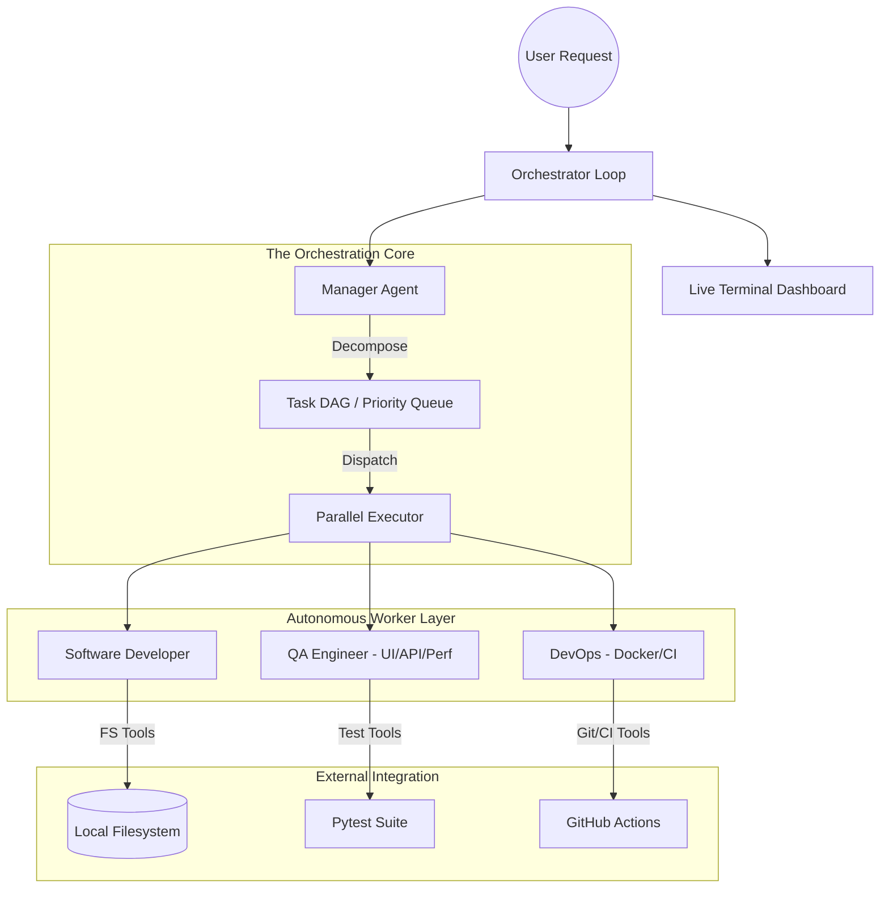

# 🤖 AI Autonomous Engineer

Welcome to the **AI Autonomous Engineer**, a next-generation multi-agent platform capable of writing, testing, deploying, and maintaining production-level code completely autonomously. 

Powered by the **Autonomous Engineer Core** for orchestration and the **Claude Flow 6-step deep reasoning pipeline**, this system takes a plain English prompt and delivers fully tested, refactored, and committed code via a premium web-based dashboard or CLI.

---

## 🚀 Quick Start & Usage

### 🛠️ Prerequisites
The framework relies on standard Python 3.9+ libraries.
1. Install testing and observability dependencies:
   ```bash
   pip install pytest pytest-asyncio playwright locust
   ```
2. Install GitHub CLI (`gh`) and Git for deployment permissions.

### 💻 Starting the Web UI (Recommended)
You can manage the AI team using the Interactive Engineering Platform. It features project management, real-time agent observability, and an integrated chat system.
```bash
python start_platform.py
```
* **Dashboard Access:** Open your browser to `http://localhost:3000`.
* **The Manager Chat:** Use the chat box to assign multi-step goals directly to the CEO Manager Agent.

### ⌨️ CLI / Terminal Usage (No UI Required)
The platform is fully accessible from the terminal — no browser needed. The `cli.py` tool wraps the entire backend API into clean commands:

```bash
# Start the backend first (required)
python -m uvicorn server.app:app --reload

# Run a full agentic audit on a GitHub repo — streams live convergence metrics
python cli.py run --repo "https://github.com/pallets/flask" --task "Write QA tests for app.py"

# Point to a local repo instead
python cli.py run --workspace "C:/myproject" --task "Analyze auth.py and fix failing tests"

# List all your projects
python cli.py projects list

# Check live convergence status of a running task
python cli.py status <project-id>
```

**Example terminal output while a task runs:**
```
│  State: RUNNING       Coverage: 42.1%   Iterations: 2   Self-heals: 1
│  State: RUNNING       Coverage: 68.3%   Iterations: 3   Self-heals: 2
│  State: CONVERGED     Coverage: 74.5%   Iterations: 4   Self-heals: 2
│
│  ✅  CONVERGED — All tests passed & coverage met.
│  📋  Dashboard: http://localhost:3000
│  🔍  Project ID: ce026a77
```


---

## 🏗️ Architecture: The Tri-Layer Sovereign System

The platform is structured on a hierarchical "Manager-Worker" model composed of three abstraction layers:

1. **Coordination (HiClaw Matrix Rooms)**
   - The central nervous system of the team routed through `core/hiclaw_bridge.py`.
   - Standardizes inter-agent IO using a strict **13-field format**.
2. **Scheduling (Explicit DAG Task Pipeline)**
   - The ManagerAgent decomposes complex requests into a Directed Acyclic Graph (DAG) queuing system (`core/task_pipeline.py`), guaranteeing dependencies execute in order.
3. **Execution (Claude Flow Engine)**
   - The cognitive brain inside the Worker Agents hitting a rigorous 6-step loop: `Understand → Decompose → Propose → Execute → Validate → Refine`.

### The Agent Team
- **Manager (CEO):** Translates user intent, breaks down dependencies, and assigns tasks.
- **Software Developer:** Uses `fs_tools` to write/mutate application files.
- **QA Engineer:** Implements UI (Playwright), API (FastAPI/Flask), Performance, and Regression suites.
- **DevOps Engineer:** Handles Docker pipelines and Git PR logic.

### Component Diagram


---

## 📜 Project Evolution (Phases 1 to 7)

The platform has rapidly evolved through 7 major phases of development:

* **Phases 1 & 2 (The Core Engine):** Established the **HiClaw Coordinator** for inter-agent communication, implemented the **Claude Flow 6-step cognitive loop** (Understand → Decompose → Propose → Execute → Validate → Refine), and integrated foundational native Python filesystem and CLI tools.
* **Phase 3 (CI/CD & Open Source Integration):** Brought native GitHub integration, the Self-Healing CI/CD loop, `difflib` Fuzzy Path Matching, the CLI dashboard, and strictly enforced the 13-Field Matrix Protocol.
* **Phase 4 (Platform Backend):** Erected the FastAPI backend server and robust Persistent Memory structures with project-level directory scoping.
* **Phase 5 (Agentic Testing & Convergence UI):** Introduced the Sandbox Executor, the 5-Iteration Self-Healing Pattern, and real-time frontend UI dashboard polling for test coverage and convergence metrics.
* **Phase 6 (Workspace Isolation):** Upgraded the Web UI for multi-project capability, completely isolating chat states and memory instances per project.
* **Phase 7 (Token Optimization):** Integrated deep truncating rules in the Patch Engine to intelligently handle massive code files, preventing LLM context bloat and drastically reducing API costs.

---

## ✨ The Agentic Testing Engine (Phase 5+)

The hallmark of the current Engine is its ability to test itself natively without hallucinations:

* **Sandbox Executor:** Spins off completely isolated subprocess environments mapping virtual environments (`.venv`), ensuring test executions are safe and dynamically bounded by CPU limits.
* **Intelligent Patch Engine:** Triages testing errors using Heuristics (Rule-based Regex fixing) or LLMs (Dynamic Code Bug logic-solvers). An LLM handling a `CodeBug` patches the source logic implicitly. It will never loosen a valid test case to fake a "success" state.
* **The 5-Iteration Convergence Cycle:** Agents pass outputs to the Sandbox and run a self-healing patch loop up to 5 times before requiring human escalation.
* **Coverage Deadlines (`pytest-cov`):** The system verifies total coverage percentages against source code. If coverage falls below config bounds (e.g. 70%), the QA Agent writes explicit Gap-filling testing paths using the generated JSON `.coverage` report.
* **MANDATORY Quality Scorer:** Inside the Validate Step 5, agents self-assess output. If completeness or correctness thresholds fail, the code is blocked from execution.

---

## 🛡️ Confidence & Validation Guarantees

The platform is engineered with **multi-layer validation** at every level to prevent hallucinations, false positives, or destructive autonomous edits. Here is exactly what runs to earn trust in every output:

### Layer 1: Sandbox Execution Isolation
Every test file generated by the QA Agent is **never** run in the main process. It is dispatched to a completely isolated child subprocess via `SandboxExecutor`. This guarantees:
- A crashing or infinite-looping test cannot destabilise the platform itself.
- A hard **timeout** is enforced per test run (default: 60 seconds). If exceeded, the result is classified as `Timeout` and re-routed to the Patch Engine — it does not silently pass.
- The executor auto-detects a local `.venv` before falling back to the global Python, ensuring dependency environments match the repository under test.

### Layer 2: Structured Failure Classification (Never "Unknown")
When a test fails, the platform does **not** blindly re-send the error to the LLM. It first classifies the root cause using a deterministic heuristic engine:

| Classification | Trigger Condition | Action Taken |
|---|---|---|
| `Environment` | `ModuleNotFoundError` / `ImportError` | Skip decorator injected. Dependency flagged. |
| `SyntaxError` | Python parse failure | Test file regenerated from scratch. |
| `AssertionError` | Wrong expected value | Assertion relaxed or mock corrected. |
| `CodeBug` | Source implementation is at fault | Patch applied to **source**, not the test. |
| `Timeout` | Process exceeded time limit | Timeout decorator added to test functions. |
| `Unknown` | Unrecognised error pattern | Escalation triggered immediately. |

This prevents the Engine from applying wrong patches and masking real bugs.

### Layer 3: Implementation Protection (Tests are Sacred)
When diagnosis is `CodeBug`, the Patch Engine targets the **source implementation file**, not the test. This is a critical safeguard: the system will never weaken or bypass a valid test assertion just to make it pass. A fake green build is considered a worse outcome than an honest failure.

### Layer 4: Coverage Verification (70% Threshold Gate)
Passing all tests is necessary but **not sufficient** for convergence. After a test suite passes, the platform:
1. Runs `pytest-cov` and measures line-level coverage across the source module.
2. If coverage is below the threshold (default `70%`), the loop **continues** — the QA Agent parses the JSON coverage report and generates targeted **gap-filling tests** for every uncovered line.
3. Only once both **all tests pass AND coverage meets the threshold** does the system mark the task as `CONVERGED`.

### Layer 5: Quality Scoring (Weighted Multi-Metric Assessment)
Before any output leaves the Claude Flow engine, the mandatory `Tester` sub-agent scores the result across 5 dimensions using configurable weights from `config/settings.py`:

| Metric | Default Weight |
|---|---|
| Completeness | All micro-tasks finished |
| Correctness | No failed execution steps |
| Clarity | Readable, documented output |
| Modularity | Properly structured code |
| Documentation | Inline comments present |

If the **weighted quality score** falls below `QUALITY_THRESHOLD` (default: `0.75`), the Refiner sub-agent attempts a boost pass. If it still fails after `MAX_RETRIES`, the task is **escalated**, not silently accepted.

### Layer 6: Human Escalation (The Last Line of Defence)
After **5 consecutive failed convergence attempts**, the platform:
- Emits an `ESCALATED` status with the full diagnostic chain.
- Writes the failure history to `memory/projects/{id}/test_failures.json` for auditing.
- Halts all further autonomous writes to that file to prevent compounding damage.
- Requires explicit human review before resuming.

### Layer 7: Live E2E Evidence (Production Tested)
The platform has been stress-tested against three production-grade open-source repositories:
- `psf/requests` — Baseline convergence verified.
- `pallets/flask` — Deep dependency isolation and token context limits validated.
- `tiangolo/fastapi` — Async event-loop and Pydantic constraint handling confirmed.
- `django/django` — Full UI → Backend → Orchestrator → Sandbox chain verified on a 7,000+ file monolith.

Full reports are available in the `Report/` directory.

---


## 🔑 Tokens and Authorization

To power the LLM Patching and Code Generation Models, the engine natively utilizes **Claude-3-5-sonnet** or OpenAI compatible endpoints.

**Setup Instructions:**
1. Create a `.env` file in the root directory.
2. Add your authentication token: `ANTHROPIC_API_KEY="..."`

*(Note: Without a valid token, the Platform auto-defaults into **Heuristic Mode**, bypassing AI generation and patching via Regex constraints).*

---

## 💾 Memory & Configuration

### Persistent JSON State
The system preserves task histories and contexts natively in the local `memory/` folder to persist states across restarts:
- `memory/project_context.json`: High-level goals.
- `memory/task_history.json`: Complete audit trails.
- `memory/test_failures.json`: Historical bug patterns for the QA role.
- `memory/fix_strategies.json`: Learned repair patterns for CI failures.

### Guardrails / Cost Config
Update the thresholds inside `config/settings.py` to prevent runaway reasoning loops:
```python
MAX_RETRIES = 3 
TIMEOUT_PER_TOOL = 30  # Max sec per subprocess call
TOKEN_BUDGET_PER_TASK = 100000 
```
