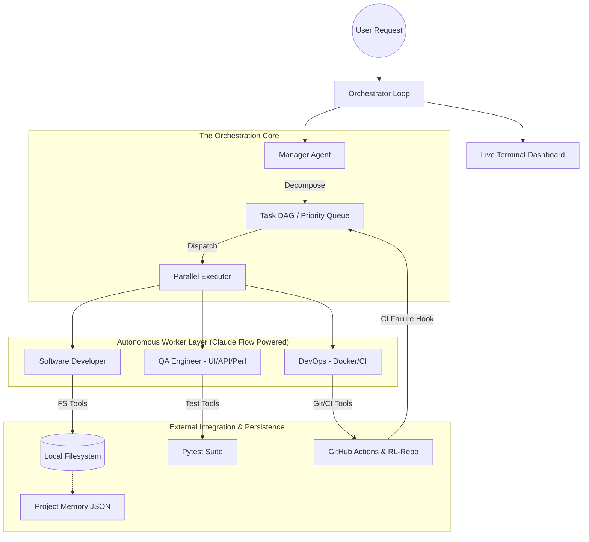

# Autonomous Engineering System — Architecture Overview

## 📐 Conceptual Hierarchy

The Engineering Platform is structured as a **Tri-Layer Sovereign System**. Each layer handles a distinct abstraction of the engineering process:

1.  **Orchestration (HiClaw):** The "Messaging Nervous System" that routes intent between actors and enforces security and protocol.
2.  **Scheduling (DAG Pipeline):** The "Strategic Planner" that breaks down high-level intent into executable unit-dependencies. 
3.  **Execution (Claude Flow):** The "Cognitive Muscle" that performs the actual mutation of code and environments via specialized tools.

---

This document outlines the production-grade architecture built to enable fully autonomous, cross-agent engineering workflows.

## 🏗️ 3-Layer Orchestration Model

The system operates on an hierarchical "Manager-Worker" model composed of three distinct technology layers:

### 1. The HiClaw Coordination Layer (`core/hiclaw_bridge.py`)
- **Purpose:** External communication and agent registry.
- **Responsibility:** Managing "Rooms" (Matrix-style), routing messages between the Manager and Workers, and enforcing the **13-Field Communication Protocol**.
- **Key Component:** `HiClawCoordinator` handles agent heartbeats and message delivery persistence.

### 2. The DAG Task Pipeline (`core/task_pipeline.py`)
- **Purpose:** Reliable task decomposition and stateful execution.
- **Responsibility:** The `ManagerAgent` decomposes complex user requests into a **Directed Acyclic Graph (DAG)**. 
- **Features:** 
  - **Priority Queuing:** `ParallelExecutor` schedules tasks based on dependencies and importance (`CRITICAL` to `LOW`).
  - **Dynamic Injection:** Post-deployment hooks (like CI failures) can inject new debugging tasks into the active graph.

### 3. The Claude Flow Execution Engine (`core/claude_flow.py`)
- **Purpose:** Internal reasoning and tool usage for Workers.
- **Responsibility:** Every `WorkerAgent` (Developer, QA, DevOps) *must* invoke Claude Flow for its thinking process.
- **The 6-Step Loop:**
  1. `Understand` -> 2. `Decompose` -> 3. `Propose` -> 4. `Execute` (Tools) -> 5. `Validate` -> 6. `Refine`.

---

## 🗺️ System Component Diagram

---

## 💾 Persistence Layer (`core/memory.py`)
The system preserves state across restarts using specialized persistent stores:
- `project_context.json`: Global goals and requirements.
- `task_history.json`: Audit trail of every decision and output.
- `test_failures.json`: Historical regression patterns for the QA role.
- `deployment_history.json`: DevOps track record and image manifests.

## 🛡️ Fault Tolerance & Cost Control
- **Tool Timeouts:** Every filesystem or CLI action is bounded by `TIMEOUT_PER_TOOL`.
- **Failure Escalation:** Manager detects worker hangs/failures and re-assigns them with higher priority or diagnostic instructions.
- **Early Stopping:** Claude Flow terminates if QA scores do not improve after $N$ rounds of refinement.
